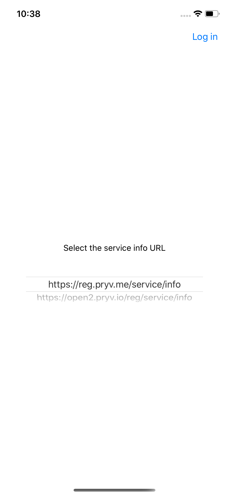
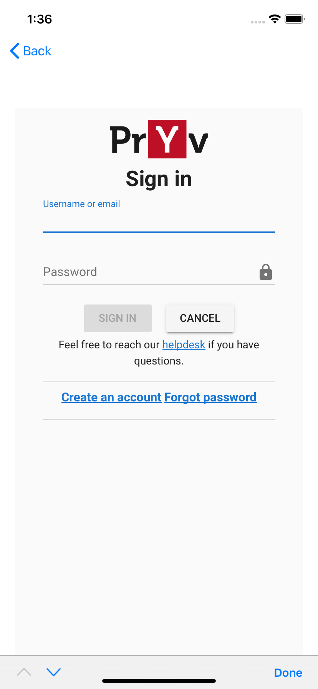
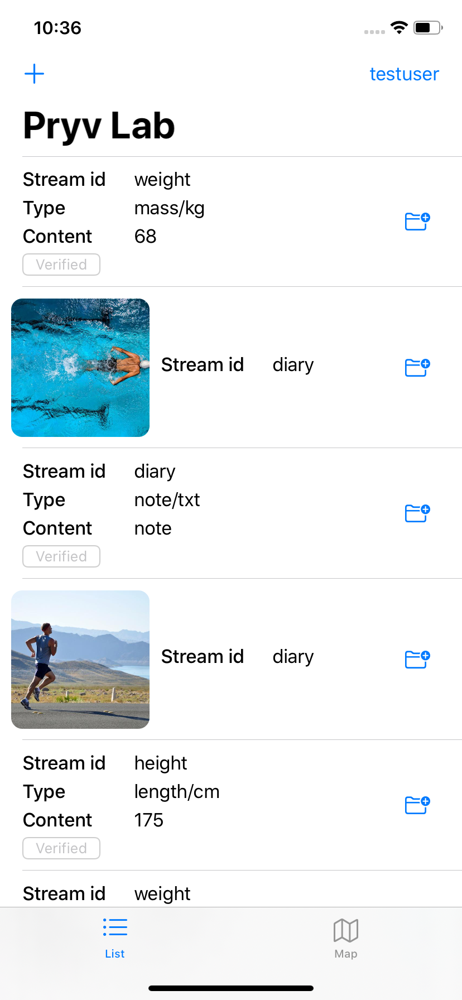
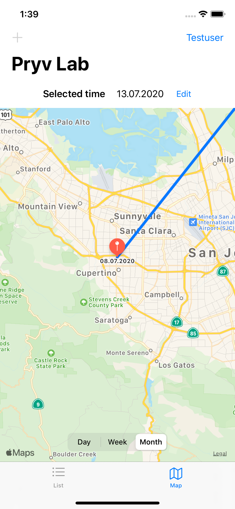

# Pryv iOS example app

Minimalistic app to discover Pryv [`lib-swift`](https://github.com/pryv/lib-swift) usage

You will get:

* **MainViewController** a simple view to sign in using a customizable service info  
* **AuthViewController** a web view to sign in and give permissions to the app from a Pryv account
* **ConnectionListTableViewController** a table view to show the last 20 events and to create new ones for a single connection
* **ConnectionMapViewController** a map view to show the position events for a single connection

These app views correspond to each of the view controllers described above: MainViewController, AuthViewController, ConnectionListTableViewController and ConnectionMapViewController respectively.

| Service info                                                 | Authentication and authorization                             | Connection list                                              | Connection map                                               |
| ------------------------------------------------------------ | ------------------------------------------------------------ | ------------------------------------------------------------ | ------------------------------------------------------------ |
|  |  |  |  |

The app integrates the Build38 T.A.K (Trusted Application Kit) solution to protect against the most common security threats. For more information about the features used, see the [integration report](https://github.com/pryv/app-ios-swift-example/blob/build38-integration/Build38Report.md). 

## Install

* install cocoa pods [cocoapods.org](https://cocoapods.org)
From `Project` folder
* run `pod install`
* if needed run `pod update`
* open Example.xcworkspace (not Example.xcodeproj)
* add your Build38 T.A.K. license and frameworks:
  *  in XCode, `file > Add files to Example ...`, select your tak license and add it to the Project and the ProjectUITests targets
  *  drag and drop the two folders `TAK-Client/iOS/Swift/libs/TAK.framework` and `TAK-Client/iOS/Swift/libs/TakTls.framework` in the `Project/Frameworks` folder in XCode project
  * add the frameworks to the Project and the ProjectUITests targets
  * in `Project > General > Frameworks, Libraries, and Embedded Content`,  chose `embed & sign` for both of the frameworks
  * in `Project > Build Phases > Link Binary with Libraries`, chose `Optional` status for both of the frameworks
  * in `ProjectUITests > Build Phases > Link Binary with Libraries`, chose `Optional` status for both of the frameworks

## Support and warranty

Pryv provides this software for educational and demonstration purposes with no support or warranty.

## License

Revised BSD license
